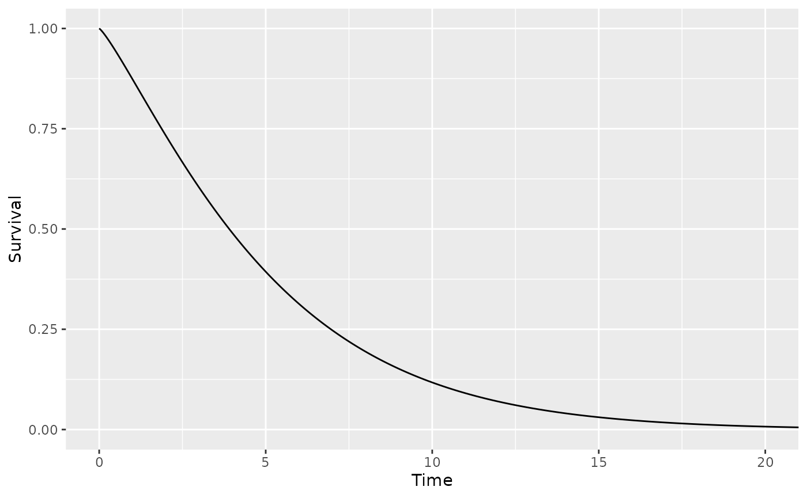

# Getting Started

The openqalysurv package makes it easier to perform applied survival
modeling in the context of Markov or partitioned survial models. This is
accomplished by providing a series functions for defining survival
distribution objects as well as a series of S3 methods that can operate
on them. These S3 methods also include generics that provide support for
survival distributions estimated from supported third-party packages
(e.g. survival, flexsurv, flexsurvcure). All survival distribution
functions, except those for generating predicted probabilities, return
survival distribution objects allowing multiple function calls to be
strung together.

## Defining a Simple Survival Distribution

The openqalysurv package contains a number of functions for defining
survival distributions of various types. For example, the
`define_surv_param` function allows you to define a parametric survival
distribution of a given family with given parameter values.

``` r

  dist1 <- define_surv_param('weibull', shape = 1.2, scale = 5.3)
```

More information on the kinds of survival distributions supported by
openqalysurv can be found in the “Defining Survival Distributions”
vignette.

## Printing a Survival Distribution

Printing an openqalysurv survival distribution will provide a
description of its contents.

``` r

  dist1 <- define_surv_param('exp', rate = 0.013)
  print(dist1)
#> An exponential distribution (rate = 0.013).
```

## Generating Survival Probabilities

Survival probabilities can be generated for a distribution using the
`surv_prob` function.

``` r

  dist1 <- define_surv_param('gompertz', shape = 0.5, rate = 0.03)
  surv_prob(dist1, seq(from = 0, to = 20, by = 1))
#>  [1]  1.000000e+00  9.618245e-01  9.020396e-01  8.114753e-01  6.815788e-01
#>  [6]  5.112229e-01  3.181818e-01  1.455949e-01  4.011965e-02  4.790944e-03
#> [11]  1.441308e-04  4.466387e-07  3.263200e-11  4.943303e-18  2.820681e-29
#> [16]  8.178752e-48  2.234814e-78 9.091561e-129 7.561005e-212  0.000000e+00
#> [21]  0.000000e+00
```

## Plotting

Survival probabilities for a distribution can be graphed using the
`plot` method.

``` r

  dist1 <- define_surv_param('weibull', shape = 1.2, scale = 5.3)
  plot(dist1, max_time = 20)
```



## Modifying and Combining Survival Distributions

Survival distributions can be modified using a variety of functions
provided by openqalysurv. For example, the `apply_hr` function can be
used to apply a hazard ratio to a survival distribution.

``` r

  dist1 <- define_surv_param('weibull', shape = 1.2, scale = 5.3)
  dist2 <- apply_hr(dist1, 0.45)
  print(dist2)
#> A proportional hazards survival distribution:
#>     * Hazard Ratio: 0.45
#>     * Baseline Distribution: A Weibull (AFT) distribution (shape = 1.2, scale = 5.3).
```

It is also possible to combine multiple survival distributions into one.
For example, the `join` function allows two survival distributions to be
joined at the specified cutpoint.

``` r

  dist1 <- define_surv_param('weibull', shape = 1.2, scale = 5.3)
  dist2 <- define_surv_param('weibull', shape = 1.4, scale = 4.1)
  dist3 <- join(dist1, 3, dist2) # Join dist2 and dist3 at time 3
  print(dist3)
#> A joined survival distribution:
#>     * Segment 1 (t = 0 - 3): A Weibull (AFT) distribution (shape = 1.2, scale = 5.3).
#>     * Segment 2 (t = 3 - ∞): A Weibull (AFT) distribution (shape = 1.4, scale = 4.1).
```

## Composing Survival Distributions

More complicated survival distributions can be created by stringing
together multiple openqalysurv operations. Use of the `%>%` operator
from magrittr is supported.

``` r


  # create an exponential distribution
  dist1 <- define_surv_param('exp', rate = 0.04)
  
  # create a survival distribution based on custom function
  dist2 <- define_surv_func(function(t) pweibull(t, 1.2, 20.1, lower.tail = FALSE))

  # create a Royston & Parmar spline model
  dist3 <- define_surv_spline(
    scale = 'hazard', # spline used to model log cumulative hazards
    -2.08, 2.75, 0.23, # parameters
    -1.62, 0.57, 1.191
  )

  dist4 <- dist1 %>% # take dist1
      apply_hr(0.4) %>% # apply a hazard ratio of 0.4 to it
      join(4, dist2) %>% # join it to dist2 at time 4
      mix(0.25, dist3, 0.75) # mix the result with dist4 with weights of 25% and 75% respectively

  print(dist4)
#> A mixed survival distribution:
#>     * Distribution 1 (25%): 
#>         A joined survival distribution:
#>             * Segment 1 (t = 0 - 4): 
#>                 A proportional hazards survival distribution:
#>                     * Hazard Ratio: 0.4
#>                     * Baseline Distribution: An exponential distribution (rate = 0.04).
#>             * Segment 2 (t = 4 - ∞): 
#>                 A survival distribution based on a custom function
#>                   Function:
#>                     function (t) 
#>                     pweibull(t, 1.2, 20.1, lower.tail = FALSE)
#>     * Distribution 2 (75%): A Royston & Parmar spline model of log cumulative hazard with 3 knots (gamma = [-2.08, 2.75, 0.23], knots = [-1.62, 0.57, 1.19]).
```
